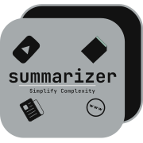

# 📄 DOCUMENT SUMMARIZER

<p align="center">
  
</p>

A web-based application that provides automatic summarization of plain text and PDF documents, with additional features like translation and speech synthesis. This project leverages Natural Language Processing (NLP) models to deliver concise and meaningful summaries — ideal for students handling large volumes of content.

## 🚀 Overview

The **Document Summarizer** allows users to:
- Upload PDF documents or input plain text.
- Generate AI-powered summaries.
- Translate the summarized content into different languages.
- Listen to summaries using built-in speech synthesis.

The tool offers an intuitive user interface and is built using modern web technologies and NLP libraries.

## 📦 Libraries & Dependencies

| Library           |  Purpose                                     |
|-------------------|----------------------------------------------|
| `Flask`           |  Backend web framework                       |
| `txtai`           |  Text summarization using transformer models |
| `PyPDF2`          |  PDF text extraction                         |
| `googletrans`     |  Text translation                            |

**Install all dependencies via:**

```bash
pip install -r requirements.txt
```

## Features

- **Versatility**: Summarizer can handle multiple formats, making it a one-stop solution for all your summarizing needs.
- **Intelligent Processing**: Leveraging advanced algorithms, Summarizer ensures that the essence of the information is captured in the summaries.
- **User-Friendly Interface**: With its intuitive design, Summarizer is easy to navigate, making the process of generating summaries seamless and efficient.

- **Set Up Virtual Environment:**

```bash
cd SummarizerV2.0/
sudo apt install python3.10-venv # For linux
python3 -m venv venv
source venv/bin/activate  # On Windows, use `venv\Scripts\activate`
```

-**Install Dependencies:**

```bash
pip install -r requirements.txt
```

-**Run the Application:**

```bash
flask run
```

## Usage

Choose the content type you want to summarize: text, documents, or YouTube videos.
Follow the prompts and input the relevant information, such as the URL of the YouTube video or the text you want to summarize.
Click the "Summarize" button to generate your summary.

## Output Screens

1. 

2. 

3. 

5. 

6. 

## Project Structure

document-summarizer/
│
├── app.py                      # Flask server
├── requirements.txt            # Python dependencies
├── templates/
│   ├── index.html              # Homepage
│   ├── text-summary.html       # Text summarization UI
│   └── doc-summary.html        # Document summarization UI
├── static/
    ├── images/                 # Logos and icons
    ├── styles/                 # CSS stylesheets
    └── script/                 # JavaScript files


